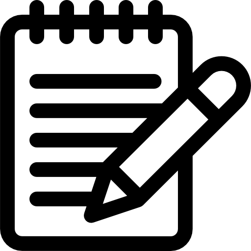

#  **LISTA DE TAREFAS** 

#### *O projeto trabalhado é uma versão de ToDoList onde as tarefas podem ser adicionadas, editadas e removidas.*

### **TECH UTILIZADAS:**

##### <input type="checkbox" id="" disabled="" class="task-list-item-checkbox" checked=""> HTML 
##### <input type="checkbox" id="" disabled="" class="task-list-item-checkbox" checked=""> CSS 
##### <input type="checkbox" id="" disabled="" class="task-list-item-checkbox" checked=""> JS

#### **inspiração de design:** *https://www.behance.net/gallery/107935847/Todo-List-Desktop-Mobile-app-UI-Design*
